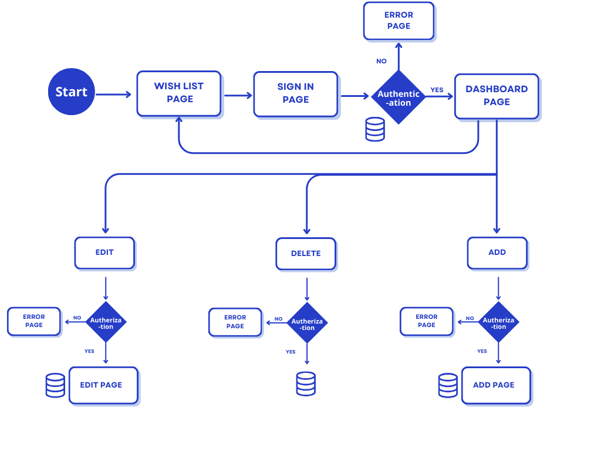

# Project Report: GIFT ME (Wishlist Website) (Admin-Only)

## Overview
This project is a wishlist management website designed for a single user (admin). The system allows the admin to add, update, and delete wishlist items efficiently. It is built using Node.js for the backend and MongoDB for database management. The project aims to provide a seamless experience for managing wishlist items.

## Flow Chart



## Setup
Follow these steps to set up the project on your local machine:

1. **Clone the repository:**
   ```bash
   git clone https://github.com/your-repo.git
   ```
2. **Navigate to the project folder:**
   ```bash
   cd wishlist-app
   ```
3. **Install dependencies:**
   ```bash
   npm install
   ```
4. **Set up environment variables:**
   Create a `.env` file and add the required configurations, such as MongoDB connection string.
5. **Run the application:**
   ```bash
   npm run dev
   ```

## Technologies Used
- **Backend:** Node.js with Express.js
- **Database:** MongoDB
- **Authentication:** JSON Web Token (JWT)
- **Frontend:** HTML, CSS, JavaScript 
- **Version Control:** Git & GitHub

## Goals
- Provide an easy to use wishlist management system for a single admin user.
- Secure data storage using MongoDB.
- Implement authentication to ensure only the admin can access the wishlist.

## Screenshots


-----------------------------------------------------------------------------------------------------------------------------


## Future Work
- Allow multiple users to create wishlist.
- Add categories for wishlist items.
- Add email notifications for updates.
- Add who bought the gift section.

## Resources
- https://www.youtube.com/watch?v=-foo92lFIto&list=PL4cUxeGkcC9hAJ-ARcYq_z6lDZV7kT1xD
- https://getbootstrap.com/
- https://www.youtube.com/watch?v=-foo92lFIto&list=PL4cUxeGkcC9hAJ-ARcYq_z6lDZV7kT1xD
- https://stackoverflow.com/questions/36325119/how-to-res-json-and-res-render-at-the-same-time-pass-mongo-db-to-angularjs
- https://nodejs.org/en/docs/
- https://www.mongodb.com/docs/
- https://expressjs.com/en/guide.html

## Team Members (G1)
- Madawee Alhathloul
- Wasan Almansour
- Nouf Alhomoud
